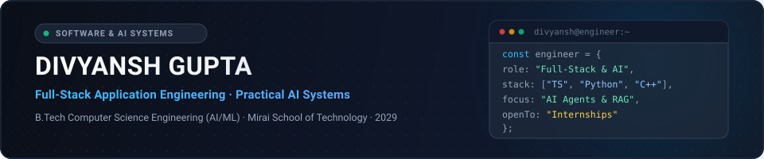
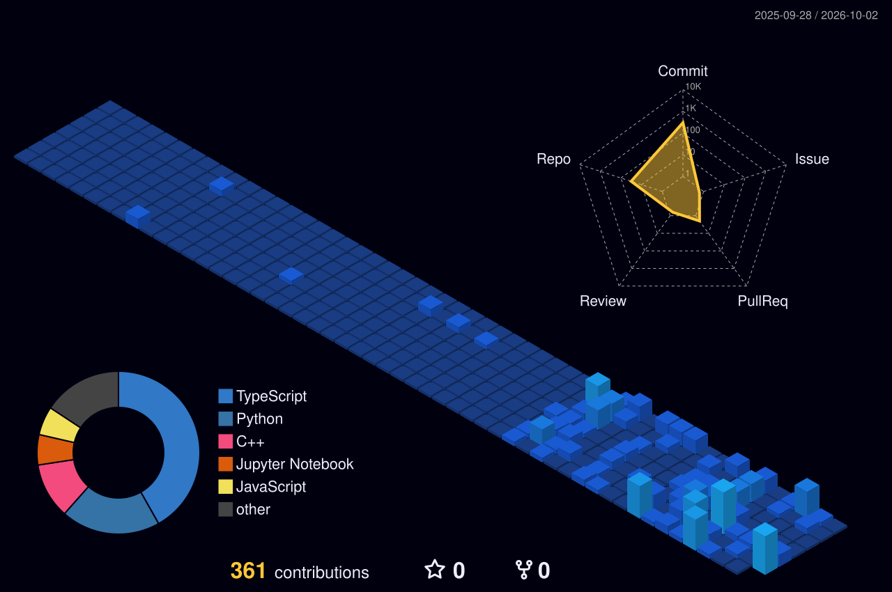

<div align="center">
  
</div>

<p align="center">
  <a href="https://github.com/Divyanshgupta2580">
    
  </a>
</p>

<p align="center">
  Second-year Computer Science Engineering student focused on building dependable full-stack applications, structured backend architectures, and practical autonomous AI agents.
</p>

<p align="center">
  <a href="https://divyansh-gupta-portfolio-lac.vercel.app/"></a>&nbsp;
  <a href="https://www.linkedin.com/in/divyanshgupta2007/"></a>&nbsp;
  <a href="https://github.com/Divyanshgupta2580"></a>&nbsp;
  <a href="mailto:inbox.DivyanshGupta1@protonmail.com" title="Contact by email"></a>
</p>

<p align="center">
  <a href="#featured-projects">Projects</a> &nbsp;·&nbsp;
  <a href="#technology-stack">Technology Stack</a> &nbsp;·&nbsp;
  <a href="#areas-of-exploration">Exploration</a> &nbsp;·&nbsp;
  <a href="#competitive-programming">Competitive Programming</a> &nbsp;·&nbsp;
  <a href="#github-analytics">Analytics</a> &nbsp;·&nbsp;
  <a href="#activity-and-contributions">Contributions</a> &nbsp;·&nbsp;
  <a href="#education">Education</a> &nbsp;·&nbsp;
  <a href="#connect-and-collaboration">Connect</a>
</p>

---

## Featured Projects

<table>
  <tr>
    <td width="50%" valign="top">
      <h3><a href="https://github.com/Divyanshgupta2580/BenifitOS_FINAL">BenefitOS</a> &nbsp;<sup><code>Full-Stack · AI / RAG</code></sup></h3>
      <p>
        Citizen welfare discovery platform designed to help individuals evaluate eligibility for public government schemes, prepare required documentation, and navigate application workflows.
      </p>
      <p>
        Engineered with a decoupled client-server architecture using React and Express.js / Node.js, modeled scheme criteria and relational dependencies in Neo4j, and integrated RAG pipelines for conversational citizen guidance.
      </p>
      <p>
        
        
        
        
        
        
      </p>
      <p>
        <a href="https://github.com/Divyanshgupta2580/BenifitOS_FINAL"><b>Source Repository</b></a> · <a href="https://benifitos-final.onrender.com/"><b>Live Deployment</b></a>
      </p>
    </td>
    <td width="50%" valign="top">
      <h3><a href="https://github.com/Divyanshgupta2580/Tron">TRON</a> &nbsp;<sup><code>AI Agent · Automation</code></sup></h3>
      <p>
        Autonomous intelligence agent that performs scheduled topic discovery, evaluates candidate news articles against editorial scoring thresholds, deduplicates items semantically, and publishes qualifying updates.
      </p>
      <p>
        Built with Python and a background scheduling pipeline to decouple intensive web search and multi-model LLM generation from query endpoints, maintaining structured local persistence and deterministic rejection logic.
      </p>
      <p>
        
        
        
        
        
      </p>
      <p>
        <a href="https://github.com/Divyanshgupta2580/Tron"><b>Source Repository</b></a>
      </p>
    </td>
  </tr>
  <tr>
    <td width="50%" valign="top">
      <h3><a href="https://github.com/Divyanshgupta2580/RevenueOS">RevenueOS</a> &nbsp;<sup><code>Full-Stack · AI / Fintech</code></sup></h3>
      <p>
        AI-powered payment recovery decision infrastructure for digital commerce that detects failed checkout transactions, evaluates recoverability, and automates bounded recovery interventions.
      </p>
      <p>
        Built with Next.js, Django, and MongoDB Atlas. Features an 8-rule deterministic policy gate (Guarded Autopilot), Gemini API reasoning, Razorpay test mode integration, and an immutable Decision Ledger audit layer.
      </p>
      <p>
        
        
        
        
        
        
      </p>
      <p>
        <a href="https://github.com/Divyanshgupta2580/RevenueOS"><b>Source Repository</b></a> · <a href="https://revenue-os-woad.vercel.app/"><b>Live Deployment</b></a>
      </p>
    </td>
    <td width="50%" valign="top">
      <h3><a href="https://github.com/Divyanshgupta2580/Student_Management_System">Student Management System</a> &nbsp;<sup><code>Full-Stack · CRUD</code></sup></h3>
      <p>
        Academic record management platform supporting administrative operations including student onboarding, record updates, profile queries, and name search.
      </p>
      <p>
        Structured around an MVC pattern with Node.js and Express.js, featuring modular REST API endpoints, form validation, MongoDB document storage, and server-rendered views.
      </p>
      <p>
        
        
        
        
      </p>
      <p>
        <a href="https://github.com/Divyanshgupta2580/Student_Management_System"><b>Source Repository</b></a>
      </p>
    </td>
  </tr>
</table>

---

## Technology Stack

<table width="100%">
  <tr>
    <td width="33.3%" valign="top">
      <b>Languages</b><br/><br/>
      
      
      
      
    </td>
    <td width="33.3%" valign="top">
      <b>Frontend</b><br/><br/>
      
      
      
    </td>
    <td width="33.3%" valign="top">
      <b>Backend</b><br/><br/>
      
      
    </td>
  </tr>
  <tr>
    <td width="33.3%" valign="top">
      <b>Databases</b><br/><br/>
      
      
    </td>
    <td width="33.3%" valign="top">
      <b>AI Systems</b><br/><br/>
      
      
    </td>
    <td width="33.3%" valign="top">
      <b>Tools &amp; Platforms</b><br/><br/>
      
      
      
    </td>
  </tr>
</table>

---

## Areas of Exploration

- **Full-Stack Application Engineering:** Constructing modular, type-safe web applications with TypeScript, React, and Node.js.
- **Backend Architecture & Database Design:** Implementing REST APIs, relational/document persistence, and graph schema modeling using Neo4j and MongoDB.
- **Autonomous AI Agents & RAG:** Designing multi-step reasoning pipelines, document retrieval systems, and scheduled worker workflows.
- **Data Structures & Algorithms:** Practicing problem-solving patterns and algorithmic efficiency using C++.
- **Open-Source Collaboration:** Contributing clean documentation, reproducible bug reports, and software utilities to developer communities.

---

## Competitive Programming

<p>
  Actively solving algorithmic challenges and sharpening data structures and computational complexity fundamentals.
</p>

<table width="100%">
  <tr>
    <td width="33.3%" valign="top">
      <b>LeetCode</b><br/>
      Algorithmic problem solving, data structures, and optimization patterns.<br/><br/>
      <a href="https://leetcode.com/u/DIVYANSHGUPTA2580/">
        
      </a>
    </td>
    <td width="33.3%" valign="top">
      <b>Codeforces</b><br/>
      Competitive programming contests and mathematical reasoning.<br/><br/>
      <a href="https://codeforces.com/profile/Divyansh_Gupta2007">
        
      </a>
    </td>
    <td width="33.3%" valign="top">
      <b>CodeChef</b><br/>
      Contest problem solving and algorithmic complexity practice.<br/><br/>
      <a href="https://www.codechef.com/users/divyansh2007">
        
      </a>
    </td>
  </tr>
</table>

---

## GitHub Analytics

<p align="center">
  
  &nbsp;
  
</p>

---

## Activity and Contributions

### 3D Contribution View

<p align="center">
  <picture>
    <source media="(prefers-color-scheme: dark)" srcset="profile-3d-contrib/profile-night-view.svg" />
    <source media="(prefers-color-scheme: light)" srcset="profile-3d-contrib/profile-green.svg" />
    
  </picture>
</p>

### Contribution Snake

<p align="center">
  <picture>
    <source media="(prefers-color-scheme: dark)" srcset="https://raw.githubusercontent.com/Divyanshgupta2580/Divyanshgupta2580/output/github-contribution-grid-snake-dark.svg" />
    <source media="(prefers-color-scheme: light)" srcset="https://raw.githubusercontent.com/Divyanshgupta2580/Divyanshgupta2580/output/github-contribution-grid-snake.svg" />
    
  </picture>
</p>

### Coding Time Distribution

<!--START_SECTION:waka-->

```txt
Total Active Time (Last 7 Days): 14 hrs 59 mins

Languages:
TypeScript     6 hrs 13 mins ██████████░░░░░░░░░░░░░░░   40.25 %
JavaScript     2 hrs 44 mins ████░░░░░░░░░░░░░░░░░░░░░   17.71 %
Image (jpeg)   1 hr 35 mins  ███░░░░░░░░░░░░░░░░░░░░░░   10.32 %
Markdown       1 hr 33 mins  ███░░░░░░░░░░░░░░░░░░░░░░   10.12 %
C++            1 hr 21 mins  ██░░░░░░░░░░░░░░░░░░░░░░░   08.73 %
Other          29 mins       █░░░░░░░░░░░░░░░░░░░░░░░░   03.17 %

Editors & Tools:
Antigravity IDE 11 hrs 42 mins ███████████████████░░░░░░   75.67 %
VS Code         2 hrs 14 mins  ████░░░░░░░░░░░░░░░░░░░░░   14.46 %
Sublime Text    1 hr 22 mins   ██░░░░░░░░░░░░░░░░░░░░░░░   08.88 %
Copilot CLI     9 mins         ░░░░░░░░░░░░░░░░░░░░░░░░░   00.99 %
```

<!--END_SECTION:waka-->

---

## Education

**Mirai School of Technology**, Ghaziabad, India<br/>
*Bachelor of Technology in Computer Science Engineering (AI/ML)*<br/>
Expected Graduation: 2029

Focusing on core software engineering paradigms, Data Structures &amp; Algorithms, discrete mathematics, and applied machine learning systems.

---

## Connect and Collaboration

> Open to engineering internships, technical collaborations, and active open-source contributions. Feel free to reach out via email or connect on LinkedIn and X.

<p align="center">
  <a href="mailto:inbox.DivyanshGupta1@protonmail.com" title="Contact by email">
    
  </a>
  &nbsp;&nbsp;
  <a href="https://www.linkedin.com/in/divyanshgupta2007/">
    
  </a>
  &nbsp;&nbsp;
  <a href="https://x.com/DivyanshGu19605">
    
  </a>
  &nbsp;&nbsp;
  <a href="https://divyansh-gupta-portfolio-lac.vercel.app/">
    
  </a>
</p>
